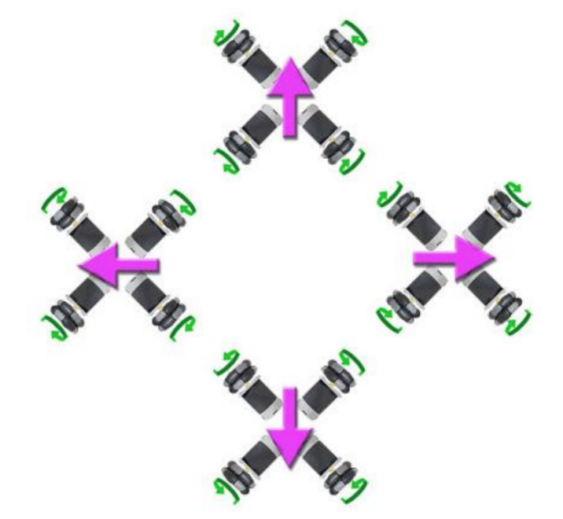
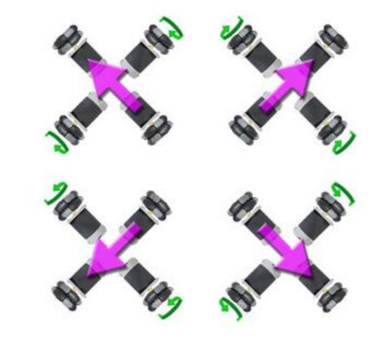
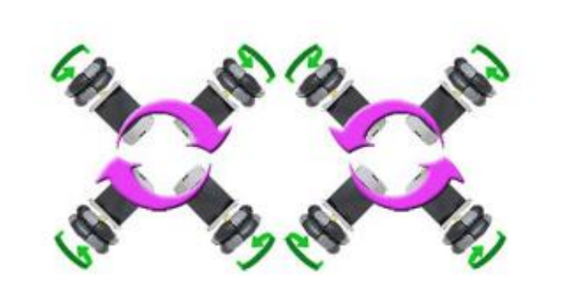
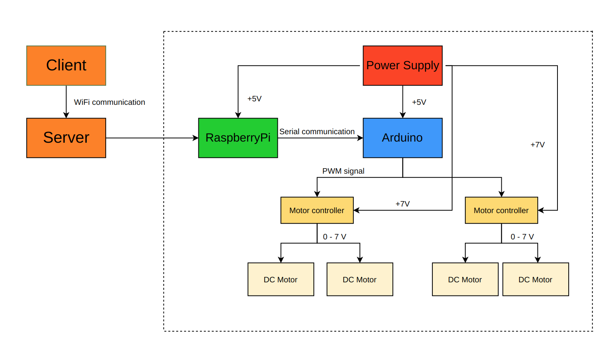
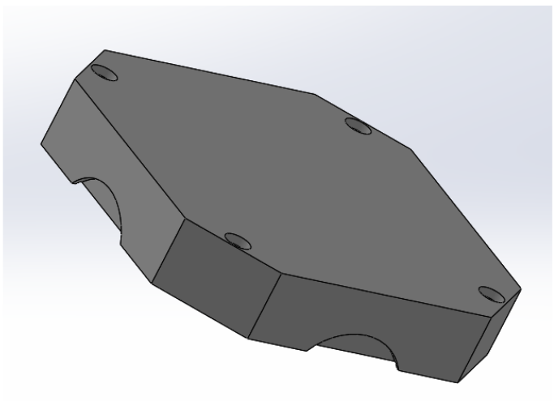
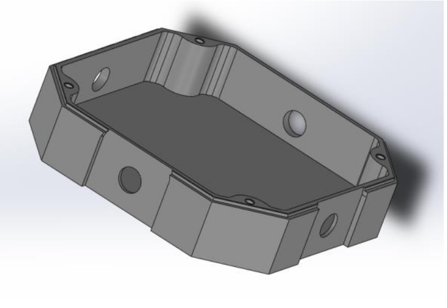
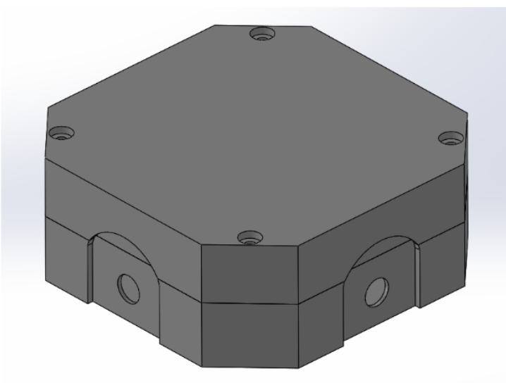

<link href="style.css" rel="stylesheet"/>

# 1. Omniwheeled Mobile Robot

## Introduction to the Mobile Robots

Mobile robots can be divided according to the power transmission system of a robot. 
Popularization of the automation systems has caused a huge interest in designing and inventing new things by amateur constructors.
These kinds of robots are are not only used in competitions or shows but also in real industry and production process.

One of the most important features in mobile robots is its high
maneuverability and freedom of movement. An interesting solution is in taking advantage of special omnidirectional wheels also called as  rollers. The wheels allow to move in every direction without rotation. It means that it's possible to change direction of movement (orientation) in place. This solution make it possible to apply in a different technology fields like internal transport, logistics, research, monitoring and among others.

A classification of the robots can be carried out on the construction or type of control. The classification division of robots can be done by its kinematic structure:
<ul>
<li> Stationary robots</li>
<li> Mobile robots</li>
</ul>

### **Division of mobile robots**

Due to various way of movements, mobile robots can be group them into categories:

<ul>
<li> Flying</li>
</ul>

<ul>
<li> Circular</li>
</ul>

<ul>
<li> Tracking</li>
</ul>

<ul>
<li> Floating</li>
</ul>

<ul>
<li> Walking</li>
</ul>

<ul>
<li> Crawling</li>
</ul>

<ul>
<li> Hybrid</li>
</ul>

### **Omniwheels kinematics**

An application of the mobile robot with multidirectional unit allows a holonomic movement on the plane. Robot's movement range is limited to four different directions and rotary motion. The purple arrows indicate the direction of robots movement, while the green arrows
determine the rotation of each individual engine.  

<ul>
<li><b>Main movement</b> - consists of two distinguish directions, the robot moves with all four electrical motors running synchronously.
</li>
</ul>

<ul>
<li>
<b>Auxiliary movement</b> - consists of two successive directions, auxiliary movement is possible thanks to the synchronous operation of only two DC motors.
</li>
</ul>

<ul>
<li>
<b>Rotational movement</b> - consists of synchronous DC motors work, all of them rotate in the same direction. 
</li>
</ul>

### Schematic

### **Model 3D**

A 3D cover was designed in SolidWorks and later made on a 3D printer.

# 2. Overview of web technologies

## Introduction

## Web Technologies

The idea of this project is to control a mobile robot via local wifi using only basic web technologies. Therefore usage of well-known HTTP protocol is reasonable and will be implemented. The biggest advantage of using web application is the fact that we are not restricted to any operation system. This application will be running in a web browser. Client-Server architecture allows to separate Frontend and Backend code, in this case server contains the whole functionality and client renders user interface.

HTTP provides stable data transmition with the following principle: 
<ul>
<li>Server - program providing services for a client, it awaits incomming requests from a client.</li>
</ul>

<ul>
<li>Client - requests a servers content or service, does not offer any resource and initiates communication session.</li>
</ul>

What is the difference between Web App and Website ?

Web Application is a program based on Client-Server architecture which requires stable Internet connection in order to communicate with server. Server is responsible for receiving and processing data then resends answer for request. Currently the standard communication protocol in a global network WWW is HTTP (Hypertext Transfer Protocol) with its encrypting version HTTPS (Hypertext Transfer Protocol Secure). In order to encrypt sending files, there is mainly applied SSL protocol (Secure Socket Layer) together with transport layer TLS (Transport Layer Security) preventing data interception.

Website is a rendered content of HTML file creating primarily in HTML, CSS and JavaScript. There are two distinguished types of websites:

<ul>
<li>
Dynamic - taking advantage of more complex model as CMS (Content Management System), it contains dynamic rendered as templates, scripts depending on server requests.
</li>
</ul>
<ul>
<li>
Static - content is rendered while loading a webpage, all files are sent to the user so it doesn't need to send requests to the server. 
</li>
</ul>

Basically what is a Web Browser? 

This is a program that gets connected to the WWW using an unique URL adress (Uniform
Resource Locator). This program downloads and presents processed data if a form of website or web app available in the web. 

Before getting into the project, let's see which technologies can be used as well on Frontend as Backend.

